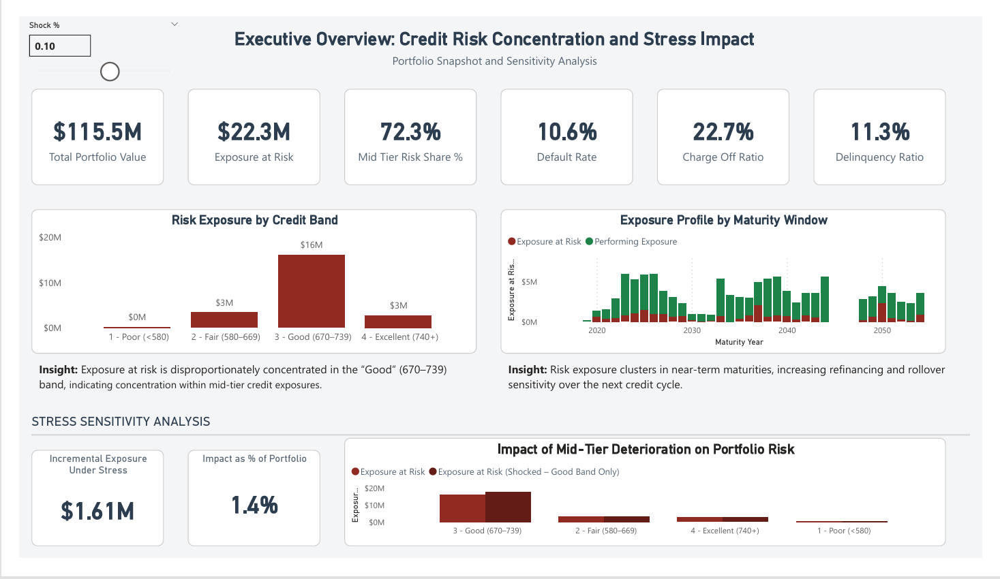
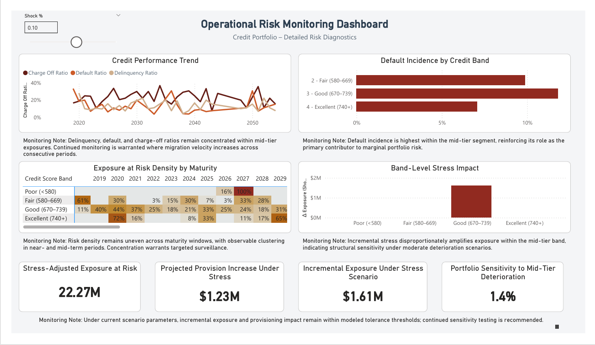

# Credit Risk Concentration & Stress Sensitivity Analysis
### Executive & Operational Power BI Dashboards

## Executive Dashboard

---

## Operational Dashboard

---

## Project Overview

This project analyzes credit portfolio risk concentration and evaluates stress sensitivity within a structured loan dataset.

The objective was to:

Identify structural drivers of exposure at risk

Assess concentration patterns across credit score bands

Analyze maturity clustering and rollover sensitivity

Simulate deterioration within the mid-tier credit segment

Translate analytical findings into executive-ready and operational dashboards

The final deliverable includes two purpose-built dashboards:

Executive Committee Overview – Strategic, decision-oriented summary

Operational Risk Monitoring Dashboard – Detailed diagnostic analytics

This project demonstrates the ability to translate statistical risk findings into actionable visual decision tools.

## Business Objective

Financial institutions must understand not only how much exposure is at risk, but also:

Where risk is concentrated

How exposure behaves under stress

Which borrower segments drive marginal deterioration

Whether maturity clustering creates refinancing vulnerability

This project bridges statistical analysis and executive reporting by converting risk insights into structured dashboards aligned with stakeholder needs.

## Analytical Approach

The analysis followed a structured framework:

### Baseline Risk Assessment

Total Portfolio Outstanding

Exposure at Risk

Delinquency Ratio

Default Rate

Charge-Off Ratio

This established structural portfolio health.

### Concentration Analysis

A segmentation analysis revealed:

Exposure at Risk is disproportionately concentrated within the mid-tier “Good” (670–739) credit band

Risk is volume-driven rather than tail-credit driven

This distinction is critical in portfolio strategy and capital planning.

### Maturity Profile Analysis

Exposure was evaluated across maturity windows to detect rollover sensitivity.

Findings showed clustering in near- and mid-term maturities, increasing potential refinancing concentration under adverse economic conditions.

### Stress Sensitivity Modeling

A parameter-driven stress simulation was implemented in Power BI using DAX.

The model applied controlled deterioration to the mid-tier credit band and measured:

Stress-adjusted Exposure at Risk

Incremental Exposure Under Stress

Estimated Incremental Provision Requirement

Portfolio Sensitivity (% impact)

This allowed dynamic scenario testing directly within the dashboard.

## Dashboard Design Philosophy

Two dashboards were intentionally created to avoid information overload:

### 1 Executive Committee Dashboard

Purpose:

Provide a strategic risk summary

Highlight structural vulnerabilities

Quantify stress sensitivity

Support capital and risk appetite discussions

Design Principles:

Clean institutional aesthetic

Minimal color (muted regulatory palette)

Structured hierarchy

Embedded insight captions

Controlled stress interactivity

This page prioritizes clarity and decision-readiness.

### 2 Operational Risk Monitoring Dashboard

Purpose:

Monitor deterioration trends

Analyze migration velocity

Assess band-level and maturity-level concentration

Perform interactive stress testing

Design Features:

Heatmap risk density grid

Trend analysis visuals

Band-level diagnostic views

Interactive stress simulation lab

Monitoring-note captions for governance tone

This page supports active risk management.

## Key Insights

Exposure at Risk is structurally concentrated within the mid-tier credit band.

Portfolio fragility is driven by volume sensitivity rather than extreme tail borrowers.

Maturity clustering creates rollover sensitivity within near-term windows.

A moderate deterioration in mid-tier credit quality produces measurable incremental exposure and provisioning impact.

Stress sensitivity modeling confirms that mid-tier performance is the primary channel of portfolio risk amplification.

## What These Dashboards Help Leadership Decide

These dashboards were designed not as reporting tools, but as structured decision-support instruments. They enable leadership to evaluate portfolio structure, risk sensitivity, and capital implications under varying credit conditions.

### 1️ Capital Allocation & Risk Appetite

Is exposure concentration aligned with stated risk appetite?

Does mid-tier credit exposure represent structural vulnerability?

Should portfolio growth be moderated in specific credit bands?

The Executive Dashboard highlights where risk is volume-driven versus tail-risk driven, supporting informed capital allocation decisions.

### 2️ Stress Readiness & Scenario Planning

How sensitive is the portfolio to moderate deterioration in mid-tier credit quality?

What is the incremental exposure impact under a 5–10% stress scenario?

Are current provisions sufficient under modeled deterioration?

The interactive stress parameter allows leadership to simulate deterioration and immediately observe exposure and provisioning implications.

### 3️ Concentration Risk Oversight

Is exposure disproportionately concentrated in a single credit segment?

Does portfolio structure amplify marginal increases in default risk?

Should concentration limits be reviewed?

The Risk Concentration and Band-Level Impact visuals identify structural exposure clusters that may warrant policy review.

### 4️ Rollover & Maturity Risk Monitoring

Are near-term maturities clustered in higher-risk segments?

Does refinancing sensitivity create cyclical vulnerability?

Should maturity ladder adjustments be considered?

The Maturity Exposure Profile highlights temporal clustering and rollover concentration risk.

### 5️ Operational Monitoring Priorities

For operational managers, the dashboards support:

Identification of segments requiring intensified monitoring

Tracking of delinquency and default trend acceleration

Targeted stress surveillance within mid-tier exposures

## Strategic Outcome

Together, the dashboards transform static portfolio metrics into forward-looking risk intelligence, enabling:

Proactive concentration management

Structured stress testing

Risk-adjusted decision-making

Alignment between executive oversight and operational monitoring

## Why These Visuals Were Chosen

The visualization architecture was intentionally designed to align with decision hierarchy, cognitive load management, and risk communication principles rather than aesthetic preference.

Each visual was selected based on the type of decision it supports.

### KPI Cards (Executive Summary Layer)

Purpose: Immediate situational awareness.

KPI cards were used to present total exposure, exposure at risk, delinquency ratio, and stress impact because leadership requires rapid signal detection before exploring diagnostics.

Cards reduce cognitive friction and anchor attention to the most material metrics.

### Clustered Column Charts (Band-Level Risk Concentration)

Purpose: Comparative structural analysis.

Clustered columns were selected to:

Compare exposure across credit bands

Visualize concentration imbalance

Illustrate stress-adjusted impact alongside baseline exposure

Side-by-side comparisons make structural vulnerability visible without requiring detailed explanation.

### Stacked or Segmented Bar Charts (Exposure Composition)

Purpose: Proportion analysis.

Stacked visuals were used where understanding composition (performing vs exposure at risk) was more important than absolute totals.

This allows leadership to assess portfolio quality structure at a glance.

### Maturity Exposure Profile (Temporal Sensitivity)

Purpose: Rollover and clustering detection.

Time-based column visuals were chosen to reveal:

Maturity clustering

Near-term concentration

Refinancing sensitivity

Line charts were avoided here because discrete maturity distribution was more analytically meaningful than trend smoothing.

### Parameter-Driven Stress Sensitivity Panel

Purpose: Scenario modeling and fragility testing.

A slicer-controlled stress parameter was implemented to simulate deterioration within the mid-tier credit band.

This transforms the dashboard from descriptive reporting into interactive sensitivity analysis, enabling forward-looking discussion.

### Two-Page Dashboard Architecture

Purpose: Cognitive segmentation.

Instead of consolidating all visuals into a single page:

The Executive Dashboard prioritizes clarity, strategic oversight, and directional risk signals.

The Operational Dashboard provides diagnostic depth and interactive stress testing.

This separation prevents cognitive overload and aligns visual density with stakeholder needs.

## Visualization & Aesthetic Approach

The dashboards follow an institutional design framework:

Neutral background (#F4F6F8)

Muted risk red (#922B21)

Deep slate performing color (#2C3E50)

No gradients or decorative elements

Consistent typography hierarchy

Embedded analytical captions

The design prioritizes credibility, clarity, and executive alignment.

## Tools & Techniques

Power BI

DAX (parameter-driven simulation modeling)

Risk segmentation logic

Conditional formatting (threshold-based heatmaps)

Scenario-based sensitivity analysis

Executive-oriented dashboard architecture

## What This Project Demonstrates

This project reflects Senior Data Analyst capabilities in:

Translating statistical findings into business insights

Designing stakeholder-specific dashboards

Implementing dynamic stress simulations

Applying institutional visual design principles

Communicating risk clearly to executive audiences

Structuring analytical workflows end-to-end

## Project Documentation

- [DAX Measures Reference](Documentation/DAX_Measures.md)

## Author

Princewill Chibundu  
Senior Data Analyst | Risk & Financial Analytics  
Ottawa, Canada
